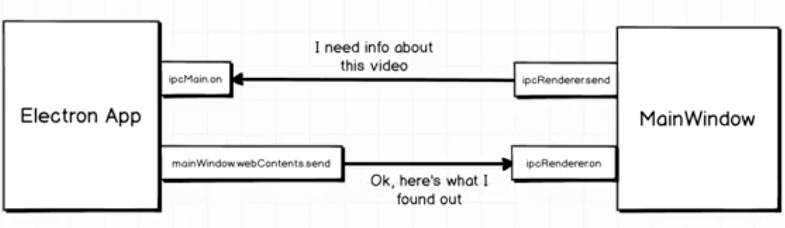

# Video Tool - Electron App

This is a basic app that has only two files. index.html and index.js

The user can find a video file on their system and then request to get its video length.

## Lessons

#### ffmpeg

ffmpeg library and fluent-ffmpeg for handling videos and getting in depth metadata on audio and video files.

#### IPC comunications

Sending data from the main window to the electron back end. Handling that information and then sending the result back to main window.

